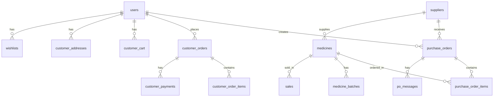

# MedIn AI Pharmacy — Complete API Documentation

> **Base URL (Render):** `https://roobi-backend.onrender.com`  
> **All responses** return JSON: `{ "success": true/false, "message": "...", "data": [...] }`  
> **Authentication:** PHP Session-based. Must call `/app/api/login.php` first.

---

## 📁 Project API Structure

```
app/api/
├── login.php                    # Auth: Login
├── register.php                 # Auth: Register
├── verify_otp.php               # Auth: Email OTP Verification
├── logout.php                   # Auth: Logout
├── ai_chat.php                  # AI Assistant Chatbot
├── notifications_api.php        # Cross-role Notifications
│
├── admin/
│   ├── po_api.php               # Purchase Orders (B2B)
│   ├── inventory_crud.php       # Medicine Inventory CRUD
│   ├── supplier_crud.php        # Supplier Management CRUD
│   ├── user_crud.php            # User Management CRUD
│   └── analytics.php            # Revenue & Inventory Analytics
│
├── pharmacist/
│   ├── dashboard_api.php        # Pharmacist Dashboard Stats
│   ├── billing_api.php          # Point-of-Sale Billing (FIFO)
│   ├── inventory_api.php        # Batch-level Inventory Management
│   └── alerts_api.php           # Low Stock & Expiry Alerts
│
├── customer/
│   ├── shop_api.php             # Browse & Search Medicines
│   ├── cart_api.php             # Shopping Cart
│   ├── checkout_api.php         # Order Checkout (FIFO deduction)
│   ├── orders_api.php           # Order History & Details
│   └── profile_api.php          # Addresses & Wishlist
│
└── shared/
    └── chat_api.php             # B2B Order Chat (Admin ↔ Supplier)
```

---

## 🔐 1. Authentication APIs

### POST `/app/api/register.php`
Register a new user account.

| Field | Type | Required | Description |
|-------|------|----------|-------------|
| `full_name` | string | ✅ | User's full name |
| `email` | string | ✅ | Unique email address |
| `phone_number` | string | ✅ | Phone number |
| `password` | string | ✅ | Min 8 characters |
| `role` | string | ✅ | `admin`, `pharmacist`, `supplier`, or `customer` |

**Success Response:**
```json
{
  "success": true,
  "message": "Account created. Please check your email for the verification code.",
  "require_verification": true,
  "email": "user@example.com"
}
```

---

### POST `/app/api/verify_otp.php`
Verify email with OTP or resend a new code.

**Verify Action:**

| Field | Type | Required |
|-------|------|----------|
| `action` | string | ✅ (`verify`) |
| `email` | string | ✅ |
| `code` | string | ✅ (6-digit OTP) |

**Resend Action:**

| Field | Type | Required |
|-------|------|----------|
| `action` | string | ✅ (`resend`) |
| `email` | string | ✅ |

---

### POST `/app/api/login.php`
Log in to the system.

| Field | Type | Required |
|-------|------|----------|
| `email` | string | ✅ |
| `password` | string | ✅ |
| `role` | string | ✅ |

**Success Response:**
```json
{
  "success": true,
  "message": "Login successful",
  "redirect": "../app/views/admin/dashboard.php"
}
```

---

### GET `/app/api/logout.php`
Destroys the session and logs the user out.

---

## 👑 2. Admin APIs

> **Access:** Requires `$_SESSION['user_role'] === 'admin'`

### Admin — Purchase Orders (`admin/po_api.php`)

| Method | Action | Description |
|--------|--------|-------------|
| `GET` | `?action=read` | List all purchase orders with supplier name & item count |
| `GET` | `?action=get_suppliers` | Get active suppliers for dropdown |
| `GET` | `?action=get_medicines` | Get all medicines for dropdown |
| `POST` | `action: create` | Create a new purchase order |
| `POST` | `action: approve_delivery` | Approve a shipped order → auto-updates inventory |
| `POST` | `action: reject_delivery` | Reject a delivery |

**Create PO — POST Body:**
```json
{
  "action": "create",
  "supplier_id": 1,
  "notes": "Urgent delivery needed",
  "due_date": "2026-06-15",
  "delivery_location": "Main Branch",
  "items": [
    { "id": 3, "qty": 100 },
    { "id": 7, "qty": 50 }
  ]
}
```

---

### Admin — Inventory CRUD (`admin/inventory_crud.php`)

| Method | Action | Description |
|--------|--------|-------------|
| `GET` | `?action=read` | List all medicines with supplier names |
| `GET` | `?action=get_suppliers` | Get active suppliers |
| `POST` | `action: create` | Add a new medicine + auto-create batch |
| `POST` | `action: update` | Update medicine details |
| `POST` | `action: delete` | Delete a medicine |
| `POST` | `action: remove_expired` | Bulk-delete all expired medicines |

**Create Medicine — POST Body:**
```json
{
  "action": "create",
  "name": "Panadol",
  "category": "Painkiller",
  "supplier_id": 1,
  "quantity": 500,
  "price": 2.50,
  "expiry_date": "2027-05-01"
}
```

---

### Admin — Supplier CRUD (`admin/supplier_crud.php`)

| Method | Action | Description |
|--------|--------|-------------|
| `GET` | `?action=read` | List all suppliers |
| `POST` | `action: create` | Add a new supplier |
| `POST` | `action: update` | Update supplier info |
| `POST` | `action: delete` | Delete supplier (blocked if linked to inventory) |

**Create Supplier — POST Body:**
```json
{
  "action": "create",
  "company_name": "PharmaCorp",
  "contact_person": "Ali Khan",
  "email": "ali@pharmacorp.com",
  "phone": "03001234567",
  "address": "Lahore, Pakistan",
  "status": "active"
}
```

---

### Admin — User CRUD (`admin/user_crud.php`)

| Method | Action | Description |
|--------|--------|-------------|
| `GET` | `?action=read` | List all users (id, name, email, role, status, branch) |
| `POST` | `action: create` | Create a new user (password auto-hashed) |
| `POST` | `action: update` | Update user (password optional) |
| `POST` | `action: delete` | Delete user (self-deletion blocked) |

---

### Admin — Analytics (`admin/analytics.php`)

| Method | Action | Description |
|--------|--------|-------------|
| `GET` | — | Returns revenue chart data (last 7 days) + inventory category distribution |

**Response:**
```json
{
  "success": true,
  "revenue": {
    "labels": ["May 20", "May 21", "..."],
    "data": [120.50, 340.00, "..."]
  },
  "inventory": {
    "labels": ["Painkiller", "Antibiotic", "..."],
    "data": [5, 3, "..."]
  }
}
```

---

## 💊 3. Pharmacist APIs

> **Access:** Requires `$_SESSION['user_role'] === 'pharmacist'`

### Pharmacist — Dashboard (`pharmacist/dashboard_api.php`)

| Method | Action | Description |
|--------|--------|-------------|
| `GET` | `?action=stats` | Get dashboard KPIs: bills today, total medicines, near-expiry, out-of-stock, 7-day sales trend, top categories |

---

### Pharmacist — Billing / POS (`pharmacist/billing_api.php`)

| Method | Action | Description |
|--------|--------|-------------|
| `GET` | `?action=search&q=panadol` | Search medicines by name (returns stock from active batches) |
| `POST` | `action: process_bill` | Process a point-of-sale bill using **FIFO** batch deduction |

**Process Bill — POST Body:**
```json
{
  "action": "process_bill",
  "discount_type": "percent",
  "discount_val": 10,
  "bag_charge": 5.00,
  "cart": [
    { "id": 3, "name": "Panadol", "qty": 2, "price": 2.50 },
    { "id": 7, "name": "Aspirin", "qty": 1, "price": 3.00 }
  ]
}
```

> [!IMPORTANT]
> Stock is deducted using **FIFO (First In, First Out)** — batches expiring soonest are sold first. Transaction rolls back if stock is insufficient.

---

### Pharmacist — Inventory (`pharmacist/inventory_api.php`)

| Method | Action | Description |
|--------|--------|-------------|
| `GET` | `?action=read` | List all medicine batches (auto-expires past-due batches) |
| `GET` | `?action=get_suppliers` | Get active suppliers |
| `POST` | `action: create` | Add new medicine |
| `POST` | `action: update` | Update medicine |
| `POST` | `action: update_batch_status` | Change batch status: `ACTIVE`, `QUARANTINED`, `DISPOSED`, `RETURNED` |

---

### Pharmacist — Alerts (`pharmacist/alerts_api.php`)

| Method | Action | Description |
|--------|--------|-------------|
| `GET` | — | Returns 4 alert categories: `low_stock`, `out_of_stock`, `expiring` (30 days), `expired` |

---

## 🛒 4. Customer APIs

> **Access:** Requires `$_SESSION['user_role'] === 'customer'`

### Customer — Shop (`customer/shop_api.php`)

| Method | Action | Description |
|--------|--------|-------------|
| `GET` | `?action=get_medicines&search=pan&category=Painkiller` | Browse/search medicines with live stock from batches |
| `GET` | `?action=get_recommendations` | AI-powered product recommendations based on purchase history |

---

### Customer — Cart (`customer/cart_api.php`)

| Method | Action | Description |
|--------|--------|-------------|
| `GET` | `?action=get_cart` | Get cart items (auto-removes out-of-stock, auto-caps quantity) |
| `POST` | `action: add` | Add medicine to cart (validates stock) |
| `POST` | `action: update` | Update cart item quantity |
| `POST` | `action: remove` | Remove item from cart |

---

### Customer — Checkout (`customer/checkout_api.php`)

| Method | Action | Description |
|--------|--------|-------------|
| `POST` | `action: process_checkout` | Place an order (FIFO stock deduction for Card payments) |

**Checkout — POST Body:**
```json
{
  "action": "process_checkout",
  "shipping_address_id": 1,
  "payment_method": "Card"
}
```

> [!NOTE]
> **Card** payments deduct stock immediately via FIFO. **COD** payments reserve the order but do not deduct stock until confirmed.

---

### Customer — Orders (`customer/orders_api.php`)

| Method | Action | Description |
|--------|--------|-------------|
| `GET` | `?action=get_orders` | List all orders for the logged-in customer |
| `GET` | `?action=get_order_details&order_id=1` | Get full order details with items, address, payment info |

---

### Customer — Profile (`customer/profile_api.php`)

| Method | Action | Description |
|--------|--------|-------------|
| `GET` | `?action=get_addresses` | List saved delivery addresses |
| `GET` | `?action=get_wishlist` | List wishlisted medicines |
| `POST` | `action: save_address` | Create or update a delivery address |
| `POST` | `action: delete_address` | Delete a delivery address |
| `POST` | `action: add_wishlist` | Add medicine to wishlist |
| `POST` | `action: remove_wishlist` | Remove from wishlist |

---

## 🚚 5. Supplier APIs

> **Access:** Requires `$_SESSION['user_role'] === 'supplier'`

### Supplier — Orders (`supplier/orders_api.php`)

| Method | Action | Description |
|--------|--------|-------------|
| `GET` | `?action=requests` | Get pending purchase orders assigned to this supplier |
| `GET` | `?action=active` | Get accepted/shipped orders |
| `GET` | `?action=history` | Get completed/rejected orders |
| `POST` | `action: update_status` | Update order status: `Accepted`, `Rejected`, `Shipped` |

**Update Status — POST Body:**
```json
{
  "action": "update_status",
  "po_id": 1,
  "status": "Accepted"
}
```

> [!TIP]
> Supplier matching works by email — the system matches the logged-in supplier user's email to the `suppliers` table. If no match is found, all POs are shown for demo purposes.

---

## 💬 6. Shared APIs

### B2B Order Chat (`shared/chat_api.php`)

> **Access:** Any authenticated user

| Method | Action | Description |
|--------|--------|-------------|
| `GET` | `?action=get&po_id=1` | Get all chat messages for a purchase order |
| `POST` | `action: send` | Send a message on a purchase order thread |

**Send Message — POST Body:**
```json
{
  "action": "send",
  "po_id": 1,
  "message": "Is this shipment arriving today?"
}
```

---

## 🔔 7. Notifications (`notifications_api.php`)

> **Access:** Any authenticated user

| Method | Description |
|--------|-------------|
| `GET` | Returns role-specific notifications: expiry alerts (admin/pharmacist), chat messages, new customer orders (admin) |

---

## 🤖 8. AI Chat Assistant (`ai_chat.php`)

> **Access:** Any authenticated user

| Method | Action | Description |
|--------|--------|-------------|
| `POST` | `message: "..."` | Send a natural language query. The AI responds with medicine prices, usage info, navigation help, and more. |

**Supported Queries:**
- `"What is the price of Aspirin?"` → Queries the database for live price & stock
- `"What are the uses of Panadol?"` → Returns category-based medical info
- `"How to buy medicines?"` → Navigation instructions
- `"hello"` → Greeting response
- `"stock"` / `"inventory"` → Inventory management tips
- `"expired"` → Expiry management guidance

---

## 🗄️ Database Tables



| Table | Description |
|-------|-------------|
| `users` | All system users (admin, pharmacist, supplier, customer) |
| `suppliers` | Registered supplier companies |
| `medicines` | Master medicine catalog |
| `medicine_batches` | Batch-level inventory with expiry tracking |
| `sales` | POS sale records |
| `bills` | Generated bill headers |
| `purchase_orders` | B2B orders from admin to suppliers |
| `purchase_order_items` | Line items in each PO |
| `po_messages` | Chat messages on PO threads |
| `customer_cart` | Customer shopping carts |
| `customer_addresses` | Saved delivery addresses |
| `customer_orders` | Customer e-commerce orders |
| `customer_order_items` | Snapshot of ordered items |
| `customer_payments` | Payment records (COD/Card) |
| `wishlists` | Customer wishlisted medicines |
